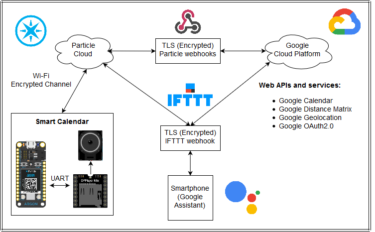

# Smart-Calendar

How to be on time every time? Moving around big cities is no easy matter because of the numerous people living around the area. A fixed alarm is often used to let you know about an upcoming event, but it does not provide a reliable departure time. Ideally, we should consider not only the current time and travel duration but also traffic conditions.

This project demonstrates how to build a device capable of solving this issue. The Smart Calendar gets the user’s current location and destination to obtain the travel duration, including traffic time. Then, with this data, it calculates at which time the user should leave to be on time. 

For a full tutorial of how to implement this project, go to https://www.hackster.io/rodruizronald/smart-calendar-powered-by-particle-and-google-98b71a

  

## Software

* Paticle Console.
* Particle Web IDE.

## License

This project is licensed under the MIT License - see the [LICENSE.md](LICENSE.md) file for details.
